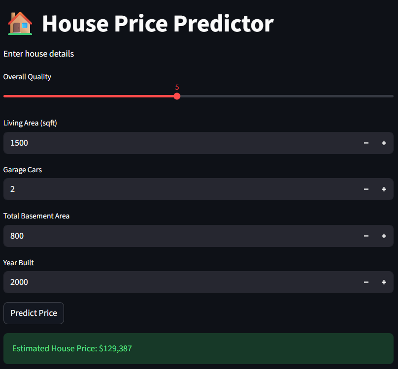

# House Price Prediction (Machine Learning + Streamlit)

## Live Demo
https://karuna-house-price-predictor.streamlit.app

## Overview
This project predicts house prices using machine learning trained on the Ames Housing dataset.

The trained model is deployed as an interactive web application where users can input house features and receive a predicted price.



## Machine Learning Pipeline
1. Data cleaning and missing value handling
2. Feature engineering using one-hot encoding
3. Model training and evaluation
4. Feature importance analysis
5. Deployment with Streamlit

## Model Performance

Linear Regression MAE: ~16308  
Random Forest MAE: ~15918

## Key Features Affecting Price
- Overall Quality
- Living Area
- Basement Area
- Garage Capacity

## Run the Application

Install dependencies:

```
pip install -r requirements.txt
```

Run the app:

```
cd app
python -m streamlit run app.py
```

Open:

```
http://localhost:8501
```

## Technologies
- Python
- Pandas
- Scikit-learn
- Streamlit